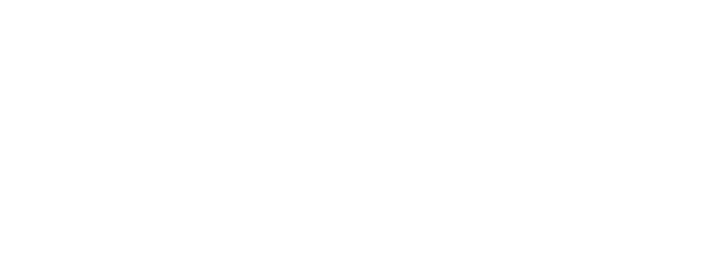

<h1 align="center"></h1>

A simple python script that allows you to use TTS in a Discord (or other app's) VC via Soundux (or any other soundboard program that allows setting custom shortcuts).

## Requirements

1. [Python 3](https://www.python.org/downloads/)

2. Any soundboard program that allows setting custom shortcuts.  
   I personally use/recommend [Soundux](https://soundux.rocks/).

## Installation/Setup

> [!Important]
> Ensure you have all of the necessary dependancies before following this guide!

1. Clone this repository.  
   If you have [`git`](https://git-scm.com/install/) installed:

   ```sh
   git clone https://github.com/DatBogie/Discord-TTS.git
   ```

   Otherwise:
   - On [the repository page](https://github.com/DatBogie/Discord-TTS) (likely the page you're on right now), click the green "<> Code" button, then the "Download ZIP" button.
   - Extract the `Discord-TTS-main.zip` file to somewhere permanent (like your Documents folder).

2. Run either `setup.sh` or `setup.bat` (only run `setup.bat` if you're on Windows).  
   **If you'd like to change the TTS voice**:
   - Open [the list of Piper-TTS voices](https://github.com/rhasspy/piper/blob/master/VOICES.md).
   - On line 5 of whichever setup script (either `setup.sh` or `setup.bat`), replace `en_US-amy-medium` with your desired voice, following the format `<language>-<name>-<low/medium/high>`, where language is the text in parenthesis (eg. `en_US`) in the list.
   - Make sure to follow step 2 in the Usage section, and change the value of `TTS Voice` on line 19 in `config.yaml`!

## Usage

> [!Important]
> If you change the value of `Soundboard Hotkey` in `config.yaml`, make sure to also update `output.wav`'s shortcut/hotkey in your soundboard app! (And vice-versa.)

1. Run either `run.sh` or `run.bat` (only run `run.bat` on Windows). You will have to re-run the app upon closing it or upon restarting your computer for it to work.  

2. Press the prompt hotkey (default: `CTRL+ALT+H`), enter anything (don't leave it blank), then press `ENTER` or click "Okay."

3. Open your soundboard app and add a new sound. If your soundboard supports adding a single file as a sound, then add `output.wav` (it'll be in the same folder this entire program is). Otherwise, add this entire program's folder.

4. Add a custom shortcut/hotkey. By default, you should set it to `LEFT_CONTROL+LEFT_ALT+RIGHT_ALT+RIGHT_CONTROL` (press both control keys and both alt keys at the same time).  
   If you'd like to set this to something else, that's fine—just make sure to update `Soundboard Hotkey`'s value in `config.yaml`, too! (See the instructions below.)

To configure this program:

1. Run the program, right click the tray icon, and click "Open Config." Alternatively, open `config.yaml` in a text editor.

2. Follow the instructions provided by the comments in the file.

## Technologies

This program includes the following technologies (bundled with pre-compiled binaries):

| Name       | License                                                                                                                                                                            | PyPI                                            | Repository                                                           | Function            |
| -          | -                                                                                                                                                                                  | -                                               | -                                                                    | -                   |
| Piper-TTS  | [GPLv3](https://raw.githubusercontent.com/OHF-Voice/piper1-gpl/refs/heads/main/COPYING)                                                                                            | [pypi.org](https://pypi.org/project/piper-tts/) | [github.com](https://github.com/OHF-Voice/piper1-gpl)                | TTS Generation      |
| PySide6    | [LGPLv3](https://code.qt.io/cgit/pyside/pyside-setup.git/plain/LICENSES/GPL-3.0-only.txt)/[GPLv3](https://code.qt.io/cgit/pyside/pyside-setup.git/plain/LICENSES/GPL-3.0-only.txt) | [pypi.org](https://pypi.org/project/PySide6/)   | [code.qt.io](https://code.qt.io/cgit/pyside/pyside-setup.git/about/) | GUI/Tray Icon       |
| pynput     | [LGPLv3](https://raw.githubusercontent.com/moses-palmer/pynput/refs/heads/master/COPYING.LGPL)                                                                                     | [pypi.org](https://pypi.org/project/pynput/)    | [github.com](https://github.com/moses-palmer/pynput)                 | Keyboard Handler    |
| PyYAML     | [MIT](https://raw.githubusercontent.com/yaml/pyyaml/refs/heads/main/LICENSE)                                                                                                       | [pypi.org](https://pypi.org/project/PyYAML/)    | [github.com](https://github.com/yaml/pyyaml)                         | YAML Parser         |
